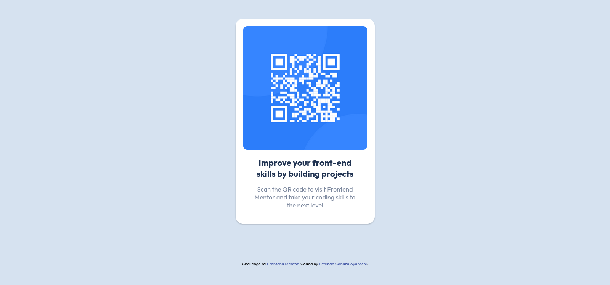

# Frontend Mentor - QR code component

This is a solution to the [QR code component challenge on Frontend Mentor](https://www.frontendmentor.io/challenges/qr-code-component-iux_sIO_H). Frontend Mentor challenges help you improve your coding skills by building realistic projects.

## Built with

- Angular
- BEN methodology
- GIT
- Prettier
- eslint

## Solution

[QR code component challenge ](https://stebanc.github.io/nft-preview-card-component/).

